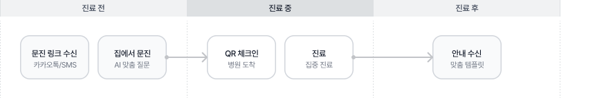
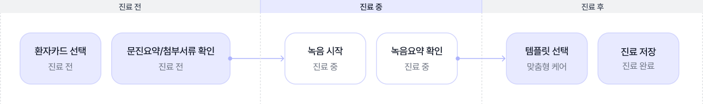
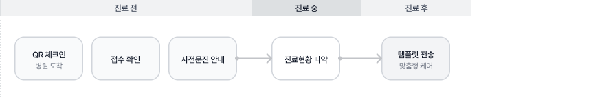

# 진료 흐름 한눈에 보기

### 환자

내원 전 카카오톡 또는 문자로 전달된 링크에서 사전 문진을 작성하실 수 있습니다. 앱 설치 없이 모바일에서 바로 이용 가능하며, 진료 후 맞춤 안내 결과를 카카오톡으로 수신하실 수 있습니다.

<figure><figcaption></figcaption></figure>

***

### 의사

진료 전 AI가 요약한 환자 문진 내용을 확인하고, 진료 중 STT 녹음으로 자동 기록됩니다. AI 추천 의증을 참고하여 진료하신 후, 맞춤 템플릿이 환자에게 자동 발송됩니다.

<figure><figcaption></figcaption></figure>

***

### 간호사 · 매니저

예약 환자에게 사전 문진 링크를 발송하고, 내원 시 QR 체크인을 처리하실 수 있습니다. 오늘 현황 화면에서 진료 진행 상태를 실시간으로 확인하고 관리하실 수 있습니다.

<figure><figcaption></figcaption></figure>

